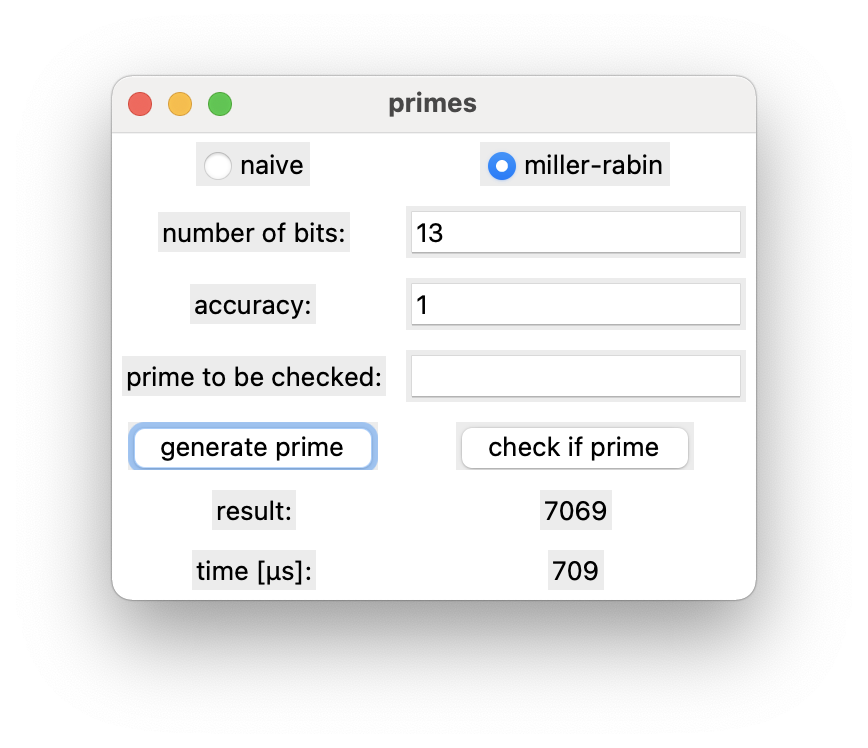

# primes

a gui app, created with [ltk](http://www.peter-herth.de/ltk/) for generating
prime numbers, and checking if a number is prime.

the app checks for primes with a naive test (checks all odd divisors from 3 to
√p), and the
[miller–rabin primality test](https://en.wikipedia.org/wiki/Miller–Rabin_primality_test).

random numbers are generated using a
[linear congruential generator](https://en.wikipedia.org/wiki/Linear_congruential_generator).

## features

* generate prime numbers:
	* choose the primality test
	* choose the number of bits for the random number
	* choose the accuracy for the `miller-rabin` primality test
* check if a number is prime:
	* choose the primality test
	* choose the accuracy for the `miller-rabin` primality test
	* choose the number to check
* the time is measured for both functions

## screenshot

