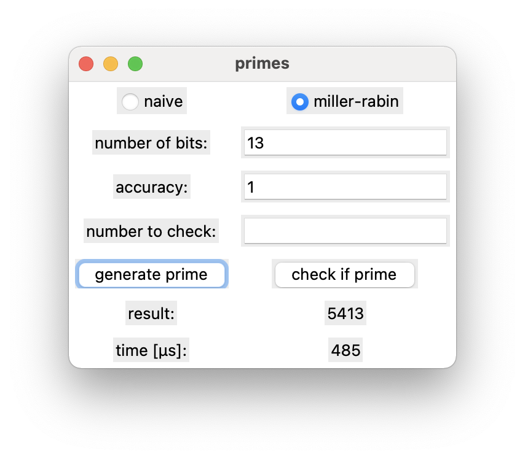

# primes

a gui app, created with [ltk](http://www.peter-herth.de/ltk/) for generating
prime numbers.

the program checks for primes with a naive test and the [miller–rabin primality test](https://en.wikipedia.org/wiki/miller%e2%80%93rabin_primality_test).

## features

* generate prime numbers based on a specified number of bits
* check, whether a number is prime or not

## screenshot



## how it works

### lcg

random numbers are generated using a [linear congruential generator](https://en.wikipedia.org/wiki/Linear_congruential_generator).

the lcg algorithm works as follows:

```
r(i+1) = a*r(i) + b (mod m)
```

the seed r(0) is set to 1.
